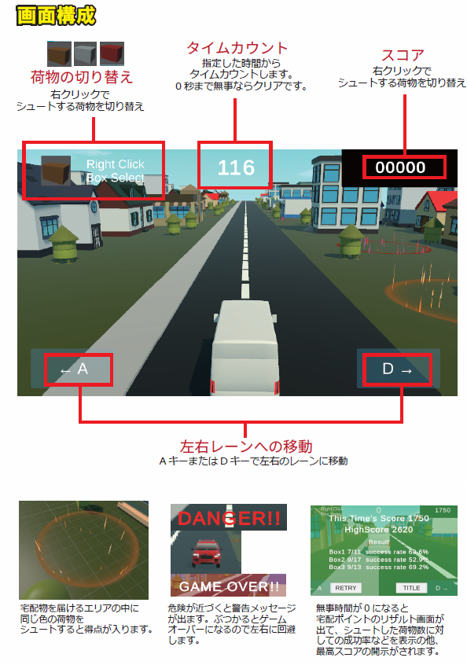
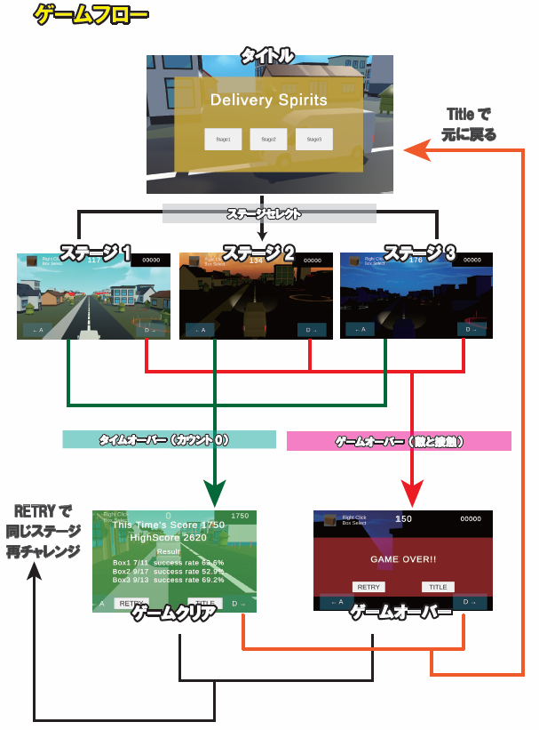

# Delivery Spirits
**WebGL：[https://31f3dz.github.io/portfolio/DeliverySpirits/](https://31f3dz.github.io/portfolio/DeliverySpirits/)**


自動で前に進むトラックから、指定された場所に荷物を届けるゲームです。
シンプルな操作でたくさんの荷物を的確に届けてポイントをGET！
油断していると接近してくる対向車とぶつかってゲームオーバー、安全運転を心がけてたくさんの住民を幸せにしましょう！

## 使用したツールなど
* Unity (ver.2022.3.62f1)
* Visual Studio
* 利用したアセット
1. Low Poly city vehicle pack Lite
2. Pandazole (City Town LowPoly Pack)
3. Area of Effect Spell FREE
4. Fantasy Skybox FREE - Release Notes -

(Unityバージョンについて)
Unity6では古いアセットが使えないリスクがあるのと、CinemaShineの操作方法が大きく変更されているため、開発効率を上げるために旧来の中でも当時一番最新であったバージョンを採用しました。

(Skyboxの種類)
ゲームが重くなり過ぎないように、比較的軽くて見た目が良いものを選びました。背景はステージごとに変えて飽きが来なくなるように工夫しています。

## 制作に当たって
Unityの3Dゲーム制作のスキルを高めるため、総合的な内容を復習できるゲームを考案しました。  
* マウス操作と連動したカメラ視点
* カメラの角度を計算して宅配物が飛んで行く
* UIとカメラ視点の連動
* 宅配物を投函するときの細かな物理挙動
* エフェクトを活用したゴールエリアの設置
* ハイスコアを塗り替えるために何度も挑戦したくなるような仕組み

ひとつひとつはシンプルな作りになっているので開発も効率的に行うことができました。

## ゲーム企画
  
  
  

## 作品のポイント
### CinemaShineの活用
  
CinemaShineコンポーネントを使って、タイトル画面でダイナミックなカメラワークに切り替わるようにしています。

### SkyboxやLightingの調整
  
ステージごとにSkyboxやLightingの調整を行って雰囲気をガラッと変えることで新鮮味を得られるようにしています。

### 3つの宅配物と3つのゴール
  
エフェクトを使ったゴールエリアを用意することで、宅配物をゴールの色に合わせて切り替えながら投函するようにし、ユーザーに忙しさを提供してゲームの面白さを底上げするよう工夫しています。

Shooter.csの抜粋
```C#
public GameObject[] boxPrefabs; // 宅配物のプレハブを格納

// 生成対象のBoxの切り替え
if (Input.GetMouseButtonDown(1))
{
    boxNum++;
    if (boxPrefabs.Length == boxNum) boxNum = 0;
}
```

Post.csの抜粋
```C#
private void OnTriggerEnter(Collider other)
{
    if (!posted)
    {
        switch (type)
        {
            case PostType.box1:
                if (other.gameObject.CompareTag("Box1"))
                    //宅配完了の処理
                    PostComp();
                    break;
            case PostType.box2:
                if (other.gameObject.CompareTag("Box2"))
                    //宅配完了の処理
                    PostComp();
                    break;
            case PostType.box3:
                if (other.gameObject.CompareTag("Box3"))
                    //宅配完了の処理
                    PostComp();
                    break;
        }                        
    }
}
```

### 宅配成功率の計算
  
ゴールに投函が成功した際にそれぞれを色別にカウントしておいて、ゲームクリア画面で成功率を出すことによって、ハイスコア以外にもやりこみ要素を提供して楽しんでもらえるように工夫しました。

```C#
//ハイスコアの更新
if (GameController.stagePoints > highScore)
{
    highScore = GameController.stagePoints;
    PlayerPrefs.SetInt(currentStageName, highScore);
}

//各スコアの表示
thisTimesScoreText.text = "This Time's Score " + currentPoint.ToString(); //ハイスコアの表示

highScoreText.text = "HighScore " + highScore; //ハイスコアの表示

//3つのBoxの成功率を表示
for(int i =0; i < resultNames.Length; i++)
{
    float successRate;
    if (Shooter.shootCounts[i] == 0) successRate = 0;
    else
    {
        //Boxの計算 ※少なくとも片方はfloatにキャスト
        successRate = ((float)Post.successCounts[i] / Shooter.shootCounts[i]) * 100f;
    }
    boxText[i].text = resultNames[i] + " " + Post.successCounts[i] + "/" + Shooter.shootCounts[i] + "  success rate " + successRate.ToString("F1") + "%";
}
GameController.gameState = GameState.timeover;
//リザルトパネルの表示
resultPanel.SetActive(true);
//カーソルロックモードの解除
Cursor.lockState = CursorLockMode.None;
Cursor.visible = true;
```

## 今後の制作
* 荷物の着地の仕方で荷物の破損率を出す
* 限られた在庫から在庫切れを起こさないように投函する
* 走るスピードを自分でコントロールできるようにして、時間制限内に配り切る
* アニメーションを使って臨場感を高める
